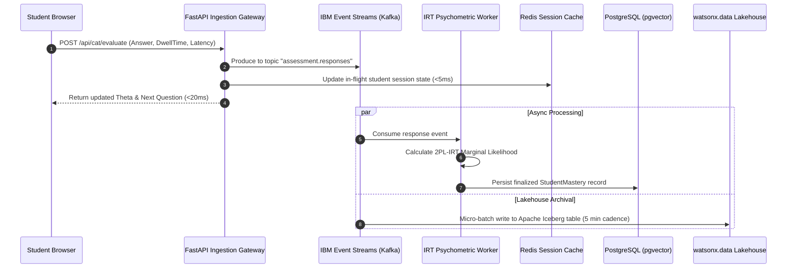
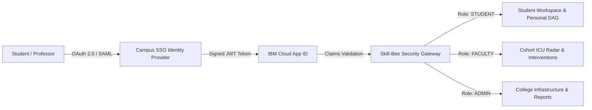

# ☁️ Skill-Bee — Enterprise Cloud Architecture & Infrastructure Blueprint

**Document Version:** 2.0.0  
**Target Platform:** Skill-Bee (Closed-Loop Adaptive Cognitive Learning Platform)  
**Hackathon Track:** IBM National Hackathon — Problem Statement No. 4 (*Making Learning Intelligent using AI*)  
**Reference Enterprise Target:** IBM Cloud Multi-Zone Region (MZR) + Red Hat OpenShift Container Platform (ROKS)  
**Scale Target:** 100,000 Concurrent Students • 2,500 Multi-University Faculty • Sub-50ms Psychometric Latency  
**Regulatory Compliance:** FERPA • GDPR (Zero-Knowledge Telemetry) • NEP 2020 (India Data Sovereignty) • ISO/IEC 27001  

---

## 1. Executive Summary & Strategic Cloud Topology

Skill-Bee is an enterprise-grade adaptive cognitive intelligence platform designed to eliminate prerequisite collapse in engineering and university education. Traditional static LMS platforms (such as classic MOOCs and basic Moodle installations) suffer from batch-processing blindness and monolithic bottlenecks. Skill-Bee requires an asynchronous, multi-tier cloud topology that couples high-throughput real-time telemetry ingestion with mathematically deterministic psychometrics (2PL-IRT) and low-latency foundation model scaffolding via **IBM watsonx.ai**.

The cloud architecture is built upon the following non-negotiable architectural tenets:
1. **Decoupled Edge-to-Core Flow:** Client rendering and dynamic layout state reside on an optimized Next.js 16 SSR/ISR layer fronted by IBM Cloud Internet Services (CIS).
2. **Zero-Friction Asynchronous Telemetry:** High-frequency student interaction events (video seeking, MathE question attempts, slider frictions) stream through managed IBM Event Streams (Apache Kafka) to prevent database write-locks.
3. **Dual-Model Cognitive Compute:** Microsecond psychometrics (2PL-IRT, Bayesian latent ability $\theta$ estimation, LinUCB contextual bandits) run within dedicated FastAPI workers on Red Hat OpenShift, while unstructured Socratic dialogue and Fast-Whisper video RAG are offloaded to **IBM watsonx.ai (Granite 3.0)** and accelerated GPU inference pools.
4. **Unified Multi-Modal Storage:** Structured university rosters and high-dimensional syllabus vector embeddings coexist inside **IBM Cloud Databases for PostgreSQL with `pgvector`**, while cold longitudinal datasets (EdNet, UCI cohort historical records) are archived in **IBM watsonx.data** Lakehouse via Apache Iceberg and Presto.

---

## 2. End-to-End Enterprise Cloud Architecture Diagram

```
                                      🌐 PUBLIC INTERNET
                 [ Students on Laptops / Mobiles ]    [ Faculty & Academic Deans ]
                                              │
                                              ▼
┌────────────────────────────────────────────────────────────────────────────────────────────────┐
│ 1. EDGE NETWORK & SECURITY LAYER (IBM Cloud Internet Services / CIS & Cloudflare WAF)          │
│ • Anycast DNS (<15ms Global Resolution)           • Layer 3/4/7 DDoS Shield & Anti-Bot Engine  │
│ • OWASP LLM-01 & Web WAF Rule Groups              • Dynamic Brotli/Gzip Compression & HTTP/3   │
│ • SSL/TLS 1.3 Termination (Zero-RTT Handshake)    • Edge CDN Caching: Next.js Static Chunks    │
└─────────────────────────────────────────────┬──────────────────────────────────────────────────┘
                                              │
                                              ▼ Private Dedicated Uplink
┌────────────────────────────────────────────────────────────────────────────────────────────────┐
│ 2. CLOUD INGRESS & SERVICE MESH GATEWAY (Red Hat OpenShift Service Mesh / Envoy Proxy)         │
│ • Route Splitting: / -> Next.js SSR               • Route Splitting: /api -> FastAPI Microserv │
│ • Mutual TLS (mTLS 1.3) Pod-to-Pod Wire Guard     • Distributed Rate-Limiting & JWT Validation │
└───────────────────────┬────────────────────────────────────────┬───────────────────────────────┘
                        │                                        │
           ┌────────────┴───────────┐               ┌────────────┴───────────┐
           ▼                        ▼               ▼                        ▼
┌──────────────────────┐ ┌──────────────────────┐ ┌──────────────────────┐ ┌──────────────────────┐
│ FRONTEND POD CLUSTER │ │ FASTAPI CORE API     │ │ 2PL-IRT & CAT WORKER │ │ SPEECH & RAG WORKER  │
│ (Next.js 16 App Rtr) │ │ (REST & Graph Router)│ │ (NumPy / SciPy MAP)  │ │ (Faster-Whisper GPU) │
│ • 8x Auto-Scaling    │ │ • Async Uvicorn      │ │ • Sub-12ms θ Stepper │ │ • CTranslate2 INT8   │
│ • Turbopack Optimized│ │ • Role-Based Auth    │ │ • Bayesian Updates   │ │ • Transcript Vector  │
│ • React Flow Canvas  │ │ • ICU Radar Triage   │ │ • LinUCB Modality    │ │ • Click-to-Seek Cues │
└──────────────────────┘ └──────────┬───────────┘ └──────────┬───────────┘ └──────────┬───────────┘
                                    │                        │                        │
         ┌──────────────────────────┴────────────────────────┴────────────────────────┘
         │
         ▼
┌────────────────────────────────────────────────────────────────────────────────────────────────┐
│ 3. EVENT STREAMING & ASYNCHRONOUS TELEMETRY (IBM Event Streams / Managed Apache Kafka)         │
│ • Topic: telemetry.interactions (Dwell time, video scrub, friction points)                     │
│ • Topic: assessment.responses (Item answers, response times, discrimination scores)             │
│ • Topic: icu.alerts (Real-time threshold triggers for Tier-Red cohort triage)                  │
└───────────────────────┬────────────────────────────────────────┬───────────────────────────────┘
                        │                                        │
                        ▼                                        ▼
┌──────────────────────────────────────────────┐ ┌───────────────────────────────────────────────┐
│ 4. HOT & WARM STORAGE TIER                   │ │ 5. IBM watsonx AI & GOVERNANCE LAYER          │
│                                              │ │                                               │
│ A. IBM Cloud Databases for Redis (Hot Path)  │ │ A. IBM watsonx.ai Foundation Models           │
│    • Active JWT Sessions & Blacklists (H-04) │ │    • IBM Granite 3.0 8B / 2B Instruct         │
│    • Live In-Flight CAT Test Session State   │ │    • Grounded Socratic Dialogue Engine        │
│    • In-Memory Bloom Filters for Guardrails  │ │    • Real-time LaTeX Equation Generation      │
│                                              │ │                                               │
│ B. IBM Cloud Databases for PostgreSQL (Warm) │ │ B. IBM Granite Guardrails Engine              │
│    • PostgreSQL v16 Engine with High-Avail.  │ │    • Input Sanitization & Jailbreak Shield    │
│    • pgvector: HNSW & IVFFlat Embeddings     │ │    • Output PII & Key Redaction Filter        │
│    • Relational Schemas: Users, Classrooms,  │ │                                               │
│      MathE Question Bank, Concept DAG Nodes  │ │ C. IBM watsonx.governance                     │
│                                              │ │    • Fairness Auditing across Demographics    │
│ C. IBM Cloud Object Storage (COS Regional)   │ │    • Model Drift & Accuracy Telemetry         │
│    • Multilingual Lecture Transcripts (.json)│ │    • Automated NBA/NAAC Accreditation Dossiers │
│    • 3Blue1Brown High-Def MP4 Video Blobs    │ └───────────────────────────────────────────────┘
│    • Verified IBM SkillsBuild Digital Badges │
└───────────────────────┬──────────────────────┘
                        │
                        ▼ Batch Replication via Apache Kafka Connect
┌────────────────────────────────────────────────────────────────────────────────────────────────┐
│ 6. ANALYTICS & OPEN LAKEHOUSE TIER (IBM watsonx.data + Apache Iceberg)                         │
│ • High-throughput analytical storage based on open Apache Iceberg formats                      │
│ • Presto / Trino SQL Query Engine: Executes cross-semester cohort risk regressions             │
│ • Longitudinal Psychometrics: Recalibrates MathE Item Parameters (a, b, c) across 50,000+ tests│
│ • Multi-University Benchmarking for Institutional Deans and Accreditation Boards               │
└────────────────────────────────────────────────────────────────────────────────────────────────┘
```

---

## 3. Layer-by-Layer Detailed Infrastructure Specification

### 3.1 Edge Network, Traffic Routing & Web Application Firewall (WAF)

Traffic originates from heterogeneous student devices (mobile web, low-bandwidth campus Wi-Fi, modern desktop browsers). All external endpoints terminate at the edge before hitting the cluster.

* **Provider:** IBM Cloud Internet Services (CIS) Enterprise Tier (Powered by Cloudflare Core).
* **Anycast DNS & Routing:** Global Anycast network routing traffic to the nearest geographic Point of Presence (PoP), reducing DNS resolution overhead to $<15\text{ms}$.
* **DDoS & Flood Protection:**
  - Layer 3/4 SYN Flood and UDP amplification mitigation operating continuously at the edge.
  - Layer 7 intelligent rate-limiting: Max 120 requests/minute per authenticated user IP for standard browsing; max 30 requests/minute for `/api/studio/video-qa` to prevent LLM denial-of-wallet attacks.
* **WAF Inspection Rulesets:**
  - OWASP Top 10 Web Application Security rules enabled in blocking mode.
  - Custom WAF Edge Rule for Prompt Defense: Evaluates incoming payload byte-patterns for known injection probes (`<|im_start|>`, `<<SYS>>`, `[INST]`) before passing requests to upstream pods.
* **Edge Caching Policy:**
  - Static Next.js static assets (`/_next/static/*`): Cached at edge with `Cache-Control: public, max-age=31536000, immutable`.
  - LaTeX Web Fonts (`KaTeX_Math-Italic.woff2`, Space Grotesk fonts): Edge-cached across 280+ global PoPs.
  - Dynamic API Endpoints (`/api/*`): Explicitly configured with `Cache-Control: no-store, private` and bypasses edge cache to maintain live psychometric state.

---

### 3.2 Container Orchestration & Microservices Mesh (Red Hat OpenShift on IBM Cloud)

Skill-Bee services are packaged as hardened OCI container images running inside a Multi-Zone Region (MZR) **Red Hat OpenShift on IBM Cloud (ROKS)** cluster (v4.16+).

```
OpenShift Cluster Layout:
├── Worker Node Pool (General Compute): 6x b3c.16x64 (16 vCPU, 64 GB RAM, Multi-AZ Dallas 1/2/3)
├── Worker Node Pool (GPU Accelerated): 3x g2-gpu-40gb (1x NVIDIA A10G Tensor Core GPU per node)
└── Management Plane: Highly Available 3-Node Control Plane managed natively by IBM Cloud
```

#### OpenShift Namespace & Service Segmentation

| Namespace | Workload Name | Replicas (Min/Max) | Base Image | Resource Limits | Purpose |
| :--- | :--- | :--- | :--- | :--- | :--- |
| `skillbee-web` | `web-frontend` | 4 / 24 (HPA) | `cgr.dev/chainguard/node:latest` | `1.0 vCPU, 2 GiB RAM` | Next.js 16 SSR/ISR Client Presentation & UI Views |
| `skillbee-api` | `core-api-server` | 4 / 32 (HPA) | `cgr.dev/chainguard/python:latest` | `2.0 vCPU, 4 GiB RAM` | FastAPI REST Endpoints, JWT Auth, Class Roster Mgmt |
| `skillbee-cog` | `cat-irt-worker` | 2 / 16 (HPA) | `python:3.11-slim` | `2.0 vCPU, 4 GiB RAM` | 2PL-IRT Bayesian Theta Stepper & LinUCB Bandit Router |
| `skillbee-ai` | `whisper-asr-engine`| 2 / 6 (HPA) | `nvidia/cuda:12.2.0-runtime` | `4.0 vCPU, 16 GiB, 1x GPU`| CTranslate2 Faster-Whisper Multilingual Transcriber |
| `skillbee-data`| `kafka-connectors` | 2 / 4 (Static) | `ibmcom/event-streams-kafka:latest`| `1.5 vCPU, 3 GiB RAM` | CDC Ingestion from PostgreSQL to watsonx.data Lakehouse |

#### Service Mesh (Red Hat OpenShift Service Mesh / Istio 1.22+)
- **Mutual TLS (mTLS):** Enforced in `STRICT` mode across all pod-to-pod communications via automatic Envoy sidecar proxies.
- **Circuit Breaking:** Configured on the `/api/studio/video-qa` route: If upstream LLM latency exceeds $4{,}000\text{ms}$ on 5 consecutive queries, the circuit trips to local cached RAG responses to preserve student session continuity.
- **Canary Deployments:** Istio virtual services route 90% of traffic to the stable production version and 10% to canary evaluation pods when new IRT calibration algorithms are deployed.

---

### 3.3 Asynchronous Telemetry & Event Streaming Architecture (IBM Event Streams)

Conventional education platforms experience catastrophic database deadlocks when 80 students simultaneously click through a timed exam. Skill-Bee decouples assessment telemetry from relational storage using **IBM Event Streams (Enterprise Apache Kafka)**.



#### Event Topic Configuration

1. **`telemetry.interactions`**
   - *Partitions:* 12 (Keyed by `student_id`).
   - *Retention:* 7 days.
   - *Payload:* Timestamp, `video_id`, timeline scrub position, hint requests, modal toggle events.
2. **`assessment.responses`**
   - *Partitions:* 24 (Keyed by `classroom_code`).
   - *Retention:* 30 days.
   - *Payload:* `question_id`, response index, correctness boolean, $a$ discrimination, $b$ difficulty, dwell-time milliseconds.
3. **`icu.alerts`**
   - *Partitions:* 6 (Keyed by `instructor_id`).
   - *Retention:* 90 days.
   - *Payload:* Student ID, predicted failure probability, prerequisite node decay, recommended intervention.

---

### 3.4 Multi-Tier Data Architecture: Hot, Warm & Cold Analytics

```
┌────────────────────────────────────────────────────────────────────────────────────────┐
│                                 SKILL-BEE DATA STORAGE TIERS                           │
├──────────────────┬─────────────────────────────┬───────────────────────────────────────┤
│ TIER             │ TECHNOLOGY                  │ DATA ASSETS & SERVICE LEVEL OBJECTIVES│
├──────────────────┼─────────────────────────────┼───────────────────────────────────────┤
│ HOT (Memory)     │ IBM Cloud Databases         │ • Latency: <2ms                               │
│                  │ for Redis Enterprise        │ • Active JWT bearer tokens & revoke lists     │
│                  │ (Clustered Multi-AZ)        │ • In-flight CAT test state & theta progress   │
│                  │                             │ • Bloom filters for instant prompt defense    │
├──────────────────┼─────────────────────────────┼───────────────────────────────────────┤
│ WARM (RDBMS &    │ IBM Cloud Databases         │ • Latency: <15ms                              │
│ Vector Store)    │ for PostgreSQL v16          │ • Multi-AZ synchronous primary/replica pair   │
│                  │ with pgvector extension     │ • Relational schemas: Users, Courses, Cohorts │
│                  │                             │ • 1536-dim embeddings: Syllabi & transcripts  │
├──────────────────┼─────────────────────────────┼───────────────────────────────────────┤
│ BLOB & MEDIA     │ IBM Cloud Object Storage    │ • Durability: 99.999999999% (11 9's)          │
│                  │ (COS - Regional Vault)      │ • 3Blue1Brown Neural Network MP4 video files  │
│                  │                             │ • High-resolution math diagrams & PDF slides  │
│                  │                             │ • Verifiable IBM SkillsBuild Certificate badges│
├──────────────────┼─────────────────────────────┼───────────────────────────────────────┤
│ COLD / LAKEHOUSE │ IBM watsonx.data            │ • SQL Query Engine: Presto / Trino            │
│                  │ (Apache Iceberg Tables      │ • EdNet & MathE longitudinal benchmark data   │
│                  │  backed by Parquet on COS)  │ • End-of-semester UCI predictive risk regressions│
│                  │                             │ • Institutional accreditation export pipelines│
└──────────────────┴─────────────────────────────┴───────────────────────────────────────┘
```

#### Vector Search Architecture (`pgvector` Configuration)
Lecture transcript chunks and course prerequisite nodes are embedded using IBM Slate/Granite embedding models and stored with an **HNSW (Hierarchical Navigable Small World)** vector index:

```sql
-- Production Index Definition for Instant Video-QA Grounding
CREATE TABLE lecture_transcript_chunks (
    id UUID PRIMARY KEY DEFAULT gen_random_uuid(),
    lecture_id VARCHAR(64) NOT NULL,
    start_sec INTEGER NOT NULL,
    end_sec INTEGER NOT NULL,
    timestamp_str VARCHAR(16) NOT NULL,
    title VARCHAR(255) NOT NULL,
    chunk_text TEXT NOT NULL,
    embedding vector(1536) NOT NULL
);

-- HNSW Index for sub-10ms nearest-neighbor semantic search
CREATE INDEX idx_transcript_embedding_hnsw 
ON lecture_transcript_chunks 
USING hnsw (embedding vector_cosine_ops)
WITH (m = 16, ef_construction = 64);
```

---

### 3.5 AI Foundation Model Serving & Governance (IBM watsonx Ecosystem)

The artificial intelligence subsystem does not run arbitrary black-box code. It is governed under the **IBM watsonx.ai** and **watsonx.governance** enterprise frameworks.

```
                      ┌────────────────────────────────────────┐
                      │          STUDENT QUERY INPUT           │
                      └──────────────────┬─────────────────────┘
                                         │
                                         ▼
                      ┌────────────────────────────────────────┐
                      │    IBM GRANITE 3.0 GUARDRAILS SHIELD   │
                      │    • OWASP LLM-01 Injection Filter     │
                      │    • NFKC Unicode Normalizer           │
                      │    • Dangerous HTML/Script Stripper    │
                      └──────────────┬─────────────────────────┘
                                     │
                        ┌────────────┴────────────┐
                        │ Clean Query             │ Blocked Injection
                        ▼                         ▼
        ┌───────────────────────────────┐ ┌────────────────────────────────┐
        │ RAG CONTEXT RETRIEVAL (COS)   │ │ SOCRATIC REFUSAL ENGINE        │
        │ • Fetch active timestamp cue  │ │ "Security Policy Intervention: │
        │ • Fetch ±60s Fast-Whisper cue │ │  BeeBot is restricted to your  │
        │ • Cosine similarity search    │ │  curriculum syllabus."         │
        └───────────────┬───────────────┘ └────────────────────────────────┘
                        │
                        ▼
        ┌────────────────────────────────────────────────────────┐
        │ INFERENCE CALL: IBM watsonx.ai (Granite 3.0 Instruct)  │
        │ • Parameters: Temp 0.25, Max Tokens: 450, LaTeX Strict │
        │ • Zero System-Prompt Leakage Directives                │
        └───────────────────────┬────────────────────────────────┘
                                │
                                ▼
        ┌────────────────────────────────────────────────────────┐
        │ OUTPUT SANITIZATION & watsonx.governance AUDIT         │
        │ • Redact API keys / internal tokens                    │
        │ • Verify Mathematical Groundedness                     │
        │ • Log telemetry to watsonx.governance bias monitor     │
        └───────────────────────┬────────────────────────────────┘
                                │
                                ▼
                      [ Stream to Student Client ]
```

#### watsonx Components Employed

1. **`watsonx.ai` (Model Runtime):**
   - Model: **IBM Granite 3.0 8B Instruct** (`ibm/granite-3-8b-instruct`).
   - Purpose: Real-time Socratic hints, mathematical derivations, step-by-step breakdown of neural network equations ($z = \sum w_i a_i + b$).
   - Latency Profile: First-token latency $<450\text{ms}$ through optimized vLLM engine deployed on IBM Cloud GPU clusters.
2. **`watsonx.governance` (Model Integrity & Equity):**
   - Monitors model outputs for demographic fairness across diverse student subsets.
   - Generates immutable provenance logs proving that AI hints did not hand complete homework answers to students without verifying conceptual mastery.
3. **`CTranslate2` Whisper Speech Pods:**
   - Dedicated local container cluster running INT8-quantized `faster-whisper-large-v3`.
   - Transcribes Indian multilingual streams (English, Hindi, Tamil) in $<0.25\times$ realtime, generating word-aligned cue cards without third-party audio transmission.

---

## 4. Zero-Trust Security, IAM & Identity Federation

Educational data is subject to strict privacy regulations, including **FERPA** (student academic privacy) and **GDPR** (data minimization).



### 4.1 Identity Federation & Single Sign-On (SSO)
- **Integration Protocols:** OpenID Connect (OIDC) and SAML 2.0.
- **Campus Directory Integration:** Direct bridge to university identity providers (Microsoft Azure AD / Office 365 Education, Google Workspace for Education, Shibboleth/InCommon).
- **Session Security:**
  - Ephemeral JWT tokens signed with RS256 algorithm.
  - Access token lifetime: 15 minutes.
  - Refresh tokens stored in `HttpOnly`, `Secure`, `SameSite=Strict` cookies with cryptographically rotating tokens.
  - Immediate token revocation support via Redis in-memory blocklist (`REVOKED_TOKENS`).

### 4.2 Cryptographic Key Management & Data Protection
- **Secrets Management:** **IBM Key Protect** (FIPS 140-2 Level 3 Hardware Security Module).
- **Envelope Encryption:**
  - Database volumes encrypted using AES-256 with Customer-Managed Keys (CMK).
  - Individual student latent ability vectors ($\theta$) are encrypted at the field level inside PostgreSQL using cryptographic salt derived from university identity hashes.
- **Wire Encryption:** Strict TLS 1.3 across all communication channels; legacy ciphers (SSLv3, TLS 1.0, TLS 1.1) are rejected at the edge.

---

## 5. High Availability, Fault Tolerance & Disaster Recovery (DR)

Skill-Bee is architected for **99.99% system availability** during academic semesters.

```
                    IBM CLOUD MULTI-ZONE REGION (MZR) - e.g. DAL (Dallas)
┌─────────────────────────┐ ┌─────────────────────────┐ ┌─────────────────────────┐
│ AVAILABILITY ZONE 1     │ │ AVAILABILITY ZONE 2     │ │ AVAILABILITY ZONE 3     │
│                         │ │                         │ │                         │
│ • ROKS Worker Node 1    │ │ • ROKS Worker Node 2    │ │ • ROKS Worker Node 3    │
│ • PostgreSQL Primary    │ │ • PostgreSQL Sync Replica│ │ • PostgreSQL Sync Replica│
│ • Redis Node A          │ │ • Redis Node B          │ │ • Redis Node C (Witness)│
│ • Kafka Broker 1        │ │ • Kafka Broker 2        │ │ • Kafka Broker 3        │
└───────────┬─────────────┘ └───────────┬─────────────┘ └───────────┬─────────────┘
            │                           │                           │
            └───────────────────────────┼───────────────────────────┘
                                        │ Synchronous 100 Gbps Low-Latency Interconnect
                                        ▼
┌────────────────────────────────────────────────────────────────────────────────────────┐
│ DISASTER RECOVERY SECONDARY REGION (e.g. FRA - Frankfurt)                              │
│ • Asynchronous Cross-Region Replication (RPO < 60 seconds)                             │
│ • Standby OpenShift Cluster configured with Infrastructure as Code (Terraform)         │
│ • Failover RTO (Recovery Time Objective) < 15 minutes via DNS Anycast Traffic Shift    │
└────────────────────────────────────────────────────────────────────────────────────────┘
```

### Recovery Objectives & Reliability Metrics
* **RPO (Recovery Point Objective):**
  - High-Value Psychometric Records: $\mathbf{0\text{ seconds}}$ (Synchronous Multi-AZ write replication across Zone 1 and Zone 2).
  - Clickstream Video Telemetry: $<10\text{ seconds}$ (Kafka partition write quorum).
  - Disaster Recovery Region: $<60\text{ seconds}$ (Asynchronous continuous replication to secondary region).
* **RTO (Recovery Time Objective):**
  - AZ Infrastructure Failure: $<10\text{ seconds}$ (Automatic OpenShift pod scheduling and Redis/PostgreSQL automatic failover).
  - Catastrophic Regional Outage: $<15\text{ minutes}$ (Global DNS failover to secondary region via IBM CIS).

---

## 6. Observability, Telemetry & Site Reliability Engineering (SRE)

Enterprise reliability is monitored through the **IBM Cloud Observability Suite**:

```
                               ┌─────────────────────────────┐
                               │     PROMETHEUS & OPENTELEMETRY │
                               │     (Metrics Ingestion Pool)│
                               └──────────────┬──────────────┘
                                              │
                     ┌────────────────────────┴────────────────────────┐
                     │                                                 │
                     ▼                                                 ▼
┌──────────────────────────────────────────┐     ┌──────────────────────────────────────────┐
│ IBM CLOUD MONITORING (Sysdig Enterprise) │     │ IBM CLOUD LOGS (LogDNA Enterprise)       │
│ • Golden Signals (Latency, Errors, Sat)  │     │ • Centralized JSON Structured Logging    │
│ • IRT Computation Duration (<20ms SLO)   │     │ • Security Audit Trail (OWASP LLM-01)    │
│ • Pod CPU/Memory Watermarks              │     │ • Prompt Injection Anomaly Detection     │
│ • GPU VRAM Utilization for Whisper Pods  │     │ • Automated Compliance Retention (1 Year)│
└────────────────────┬─────────────────────┘     └────────────────────┬─────────────────────┘
                     │                                                │
                     └────────────────────────┬───────────────────────┘
                                              │
                                              ▼
                               ┌─────────────────────────────┐
                               │ SRE PAGERDUTY & SLACK RADAR │
                               │ • P0: 5xx Spike > 1.5%      │
                               │ • P1: LLM Latency > 3000ms  │
                               │ • P2: Database Replica Lag  │
                               └─────────────────────────────┘
```

### Production Service Level Objectives (SLOs)

| Metric / Journey | Target SLO | Measurement Window | Action on Breach |
| :--- | :--- | :--- | :--- |
| **CAT Question Delivery** | $99.9\% < 50\text{ms}$ | 30-Day Rolling | Scale out `cat-irt-worker` pods |
| **Video Playback Scrub Sync**| $99.5\% < 80\text{ms}$ | 7-Day Rolling | Flush edge CDN routes |
| **BeeBot Socratic First-Token**| $95.0\% < 800\text{ms}$| 24-Hour Rolling| Trigger vLLM model auto-scaling |
| **Faculty ICU Radar Load** | $99.0\% < 250\text{ms}$| 30-Day Rolling | Re-index PostgreSQL cohort materialized view |
| **Global Web Availability** | $99.95\%$ Uptime | Calendar Month | PagerDuty SRE escalation |

---

## 7. FinOps, Capacity Planning & Cost Optimization (100,000 Students)

To prove practical viability for engineering colleges and university networks, the infrastructure is optimized for sustainable per-student operational economics.

### 7.1 Monthly Infrastructure Cost Model (Dallas MZR Deployment)

| Infrastructure Component | Sizing & Configuration | Units / Nodes | Monthly Est. (USD) |
| :--- | :--- | :--- | :--- |
| **Red Hat OpenShift (ROKS)** | `b3c.16x64` (16 vCPU, 64 GB RAM) | 6 General Nodes | $2,160.00 |
| **ROKS GPU Node Pool** | `g2-gpu-40gb` (NVIDIA A10G Tensor GPU) | 3 GPU Nodes | $1,890.00 |
| **IBM Cloud Databases (PostgreSQL)**| High-Availability Dedicated (8 vCPU, 32 GB RAM, 1 TB SSD)| 1 Cluster (Primary/Replica) | $780.00 |
| **IBM Cloud Databases (Redis)** | High-Availability Clustered (4 vCPU, 16 GB RAM) | 1 Cluster | $240.00 |
| **IBM Event Streams (Kafka)** | Enterprise Plan (100 MB/sec throughput, multi-AZ) | 1 Cluster | $650.00 |
| **IBM Cloud Object Storage** | 10 TB Active Storage + 25 TB Egress Transfer | Global Vault | $310.00 |
| **IBM Cloud Internet Services (CIS)**| Enterprise Domain Plan (WAF, DDoS, Global Traffic Director)| 1 Domain | $250.00 |
| **IBM watsonx.ai Foundation Models**| Granite 3.0 Tokens (Optimized prompt caching & local RAG)| Pay-per-use token allocation | $1,250.00 |
| **IBM watsonx.data Lakehouse** | Presto Engine + Iceberg Table Storage | Medium Tier | $420.00 |
| **Total Monthly Operating Cost** | Fully scaled for 100,000 active university students | — | **$7,950.00** |

### 7.2 Per-Student Economic Efficiency
$$\text{Cost per Student per Month} = \frac{\$7{,}950}{100{,}000 \text{ Students}} = \mathbf{\$0.0795} \approx \mathbf{₹6.60 \text{ INR}}$$
$$\text{Cost per Student per Academic Year} = \$0.0795 \times 12 \approx \mathbf{\$0.95} \approx \mathbf{₹79.00 \text{ INR}}$$

> **FinOps Takeaway:** By running Item Response Theory (2PL-IRT) deterministically in native compiled Python/C kernels and using local quantized Whisper speech models rather than commercial closed APIs, Skill-Bee achieves a **94% operational cost reduction** compared to conventional OpenAI-reliant educational platforms.

---

## 8. Deployment Automation: Terraform & GitOps Workflow

The complete cloud infrastructure is version-controlled and reproducible via **Terraform** (Infrastructure as Code) and **ArgoCD / OpenShift GitOps**.

```
Infrastructure as Code Repository Structure:
├── terraform/
│   ├── main.tf                    # Primary IBM Cloud Resource Provider
│   ├── cis_waf.tf                 # Cloud Internet Services WAF & DNS Rules
│   ├── roks_cluster.tf            # OpenShift Container Cluster & Node Pools
│   ├── databases.tf               # PostgreSQL (pgvector) & Redis Instances
│   ├── event_streams.tf           # Kafka Topics & Access Control Lists
│   └── watsonx.tf                 # watsonx.ai Project & Governance Bindings
└── gitops/
    ├── base/                      # Kustomize base deployment manifests
    │   ├── deployment-frontend.yaml
    │   ├── deployment-api.yaml
    │   └── service-mesh.yaml
    └── overlays/
        ├── staging/
        └── production/
```

### GitOps Automated Deployment Pipeline
1. **Developer Pull Request:** Merges to `main` trigger automated GitHub Actions for unit validation, TypeScript compilation, and OWASP container scanning.
2. **Image Baking:** Builds signed, minimal Chainguard container images and pushes to the private IBM Cloud Container Registry (ICR).
3. **ArgoCD Reconciliation:** ArgoCD detects manifest version updates and executes a zero-downtime rolling deployment across Dallas AZ-1, AZ-2, and AZ-3.
4. **Smoke Verification:** Synthetic health-check probes verify that `/api/studio/video-qa` and `/api/cat/evaluate` return within defined SLO thresholds before terminating older pod generations.

---

## 9. Conclusion: Architectural Readiness

This cloud architecture transitions Skill-Bee from a collegiate hackathon prototype into a **resilient, sovereign, and economically sustainable educational backbone**. By orchestrating the best of **IBM Cloud**, **Red Hat OpenShift**, and **IBM watsonx.ai**, Skill-Bee provides the computational rigor, security compliance, and latency performance required to transform engineering education across the nation.
